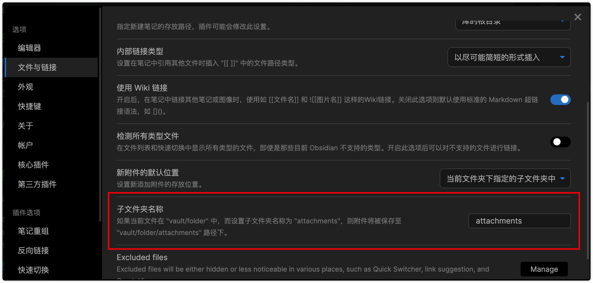
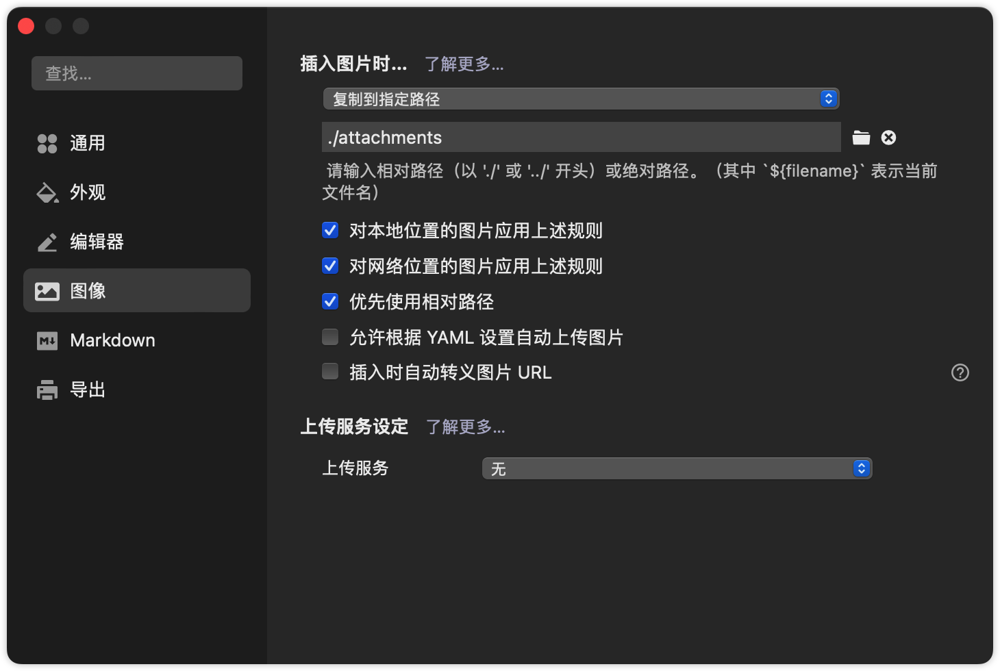

## 软件对比

| 软件           | obsidian   | typora                 | 语雀                                   | notion                       |
| -------------- | ---------- | ---------------------- | -------------------------------------- | ---------------------------- |
| 文件格式       | 纯markdown | 纯markdown             | markdown结合富文本                     |                              |
| 文件位置       | 本地       | 本地                   | 远端                                   |                              |
| 编辑难易程度   | 自己敲语法，优化不够好 | 简单封装了markdown语法 | 最简单，但导出markdown很复杂，可能导致无法正确解析           |                              |
| 所见即所得     | 支持       | 支持                   | 支持                                   |                              |
|                |            |                        |                                        |                              |
|                |            |                        |                                        |                              |
| 知识点组织形式 | 知识的链接 |                        |                                        | 知识的模块化、结构化、数据化 |
| 特点           | 插件丰富   | 无                     | 可以直接在文档中插入、编辑脑图流程图等 |                              |

传统笔记是线性笔记，难以在文件中建立关联，不方便知识的管理。

## 推荐笔记软件使用方法

### 流程总结：

1. 用 typora写新学的东西
2. 用ob和已经的笔记关联
3. 用notion 存档整理

### typora 结合 ob 时注意
#### 附件默认位置设置

- ob

- typora

